# **UX Challenge #2**
-----

- ### **Objetivo**

Identificar los elementos de Navegación de los siguientes sites: Breather, Github y Medium.

- ### **Site 1: Breather**

    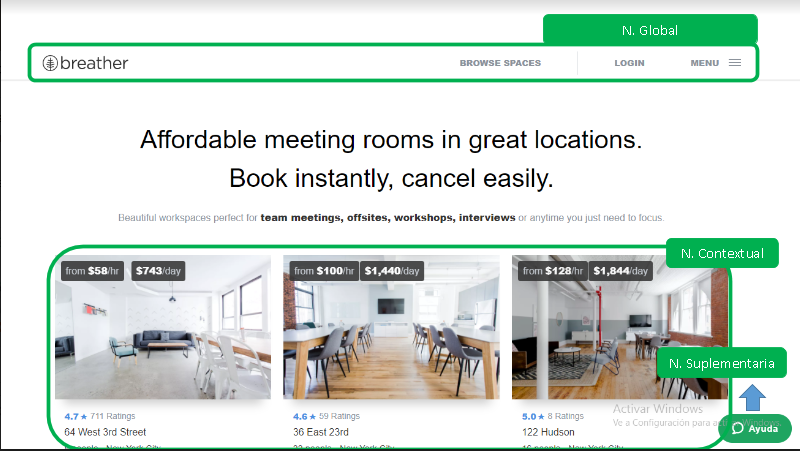

    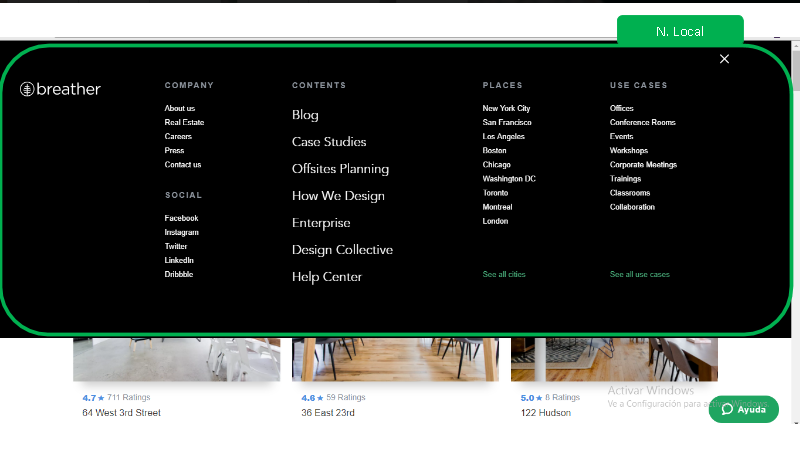

    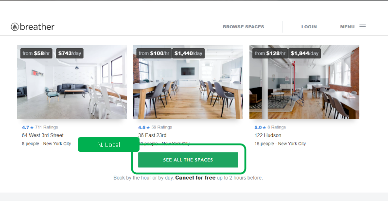

    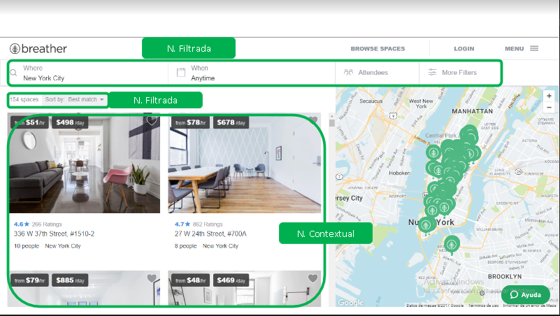

    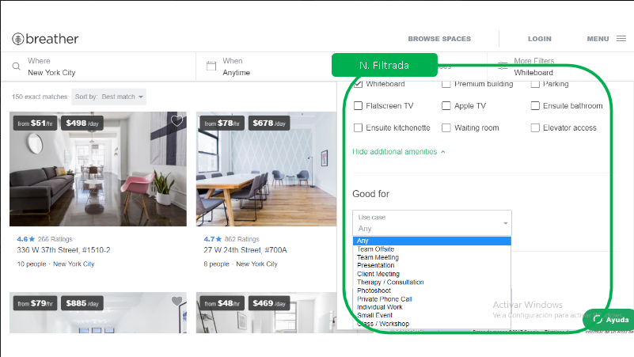

    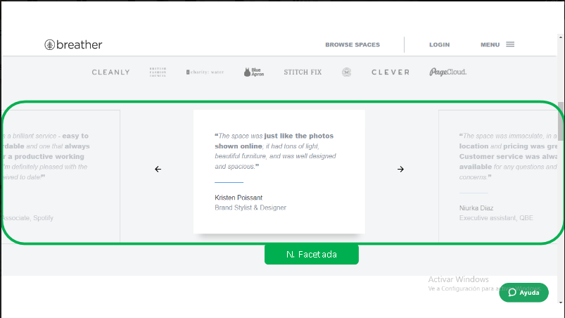

    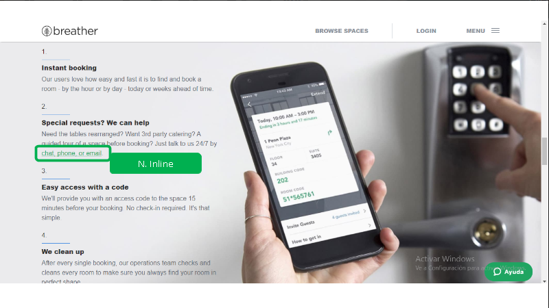

    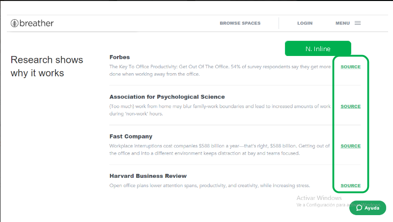

- ### **Site 2: Github**

    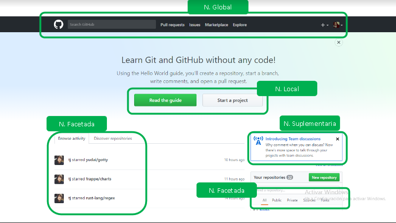

    
    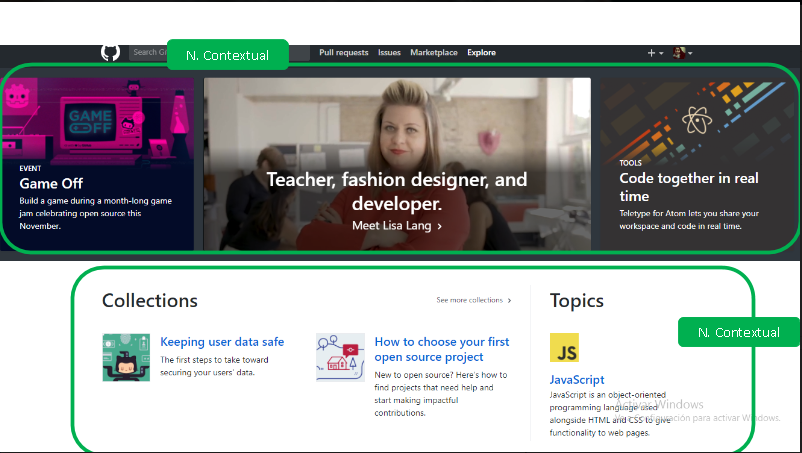

    
    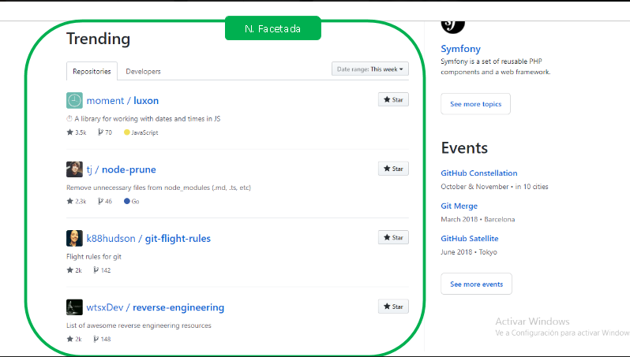

    
    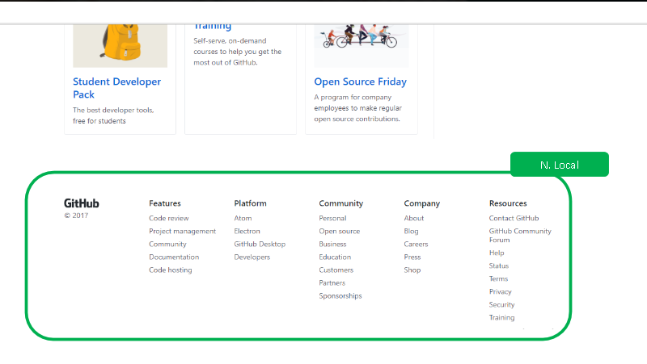

- ### **Site 3: Medium**

    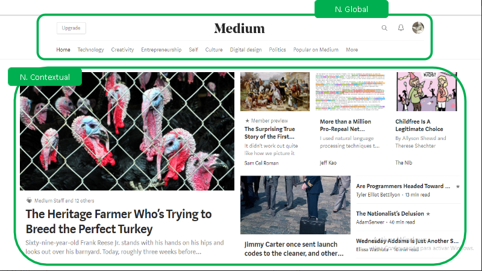

    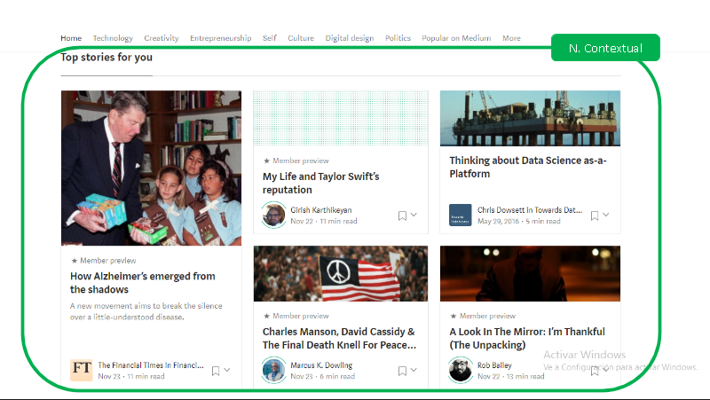

    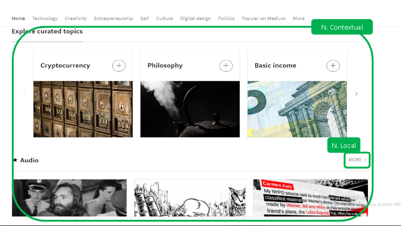

    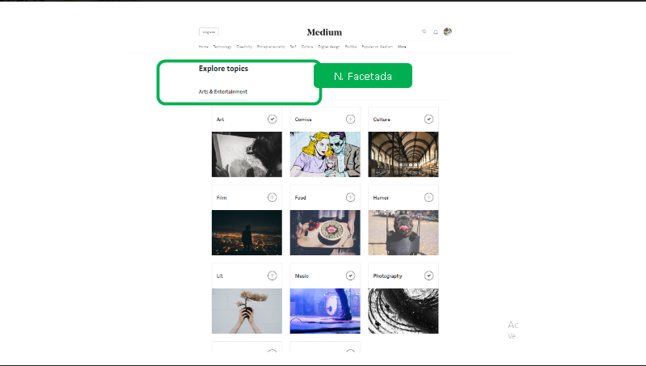

